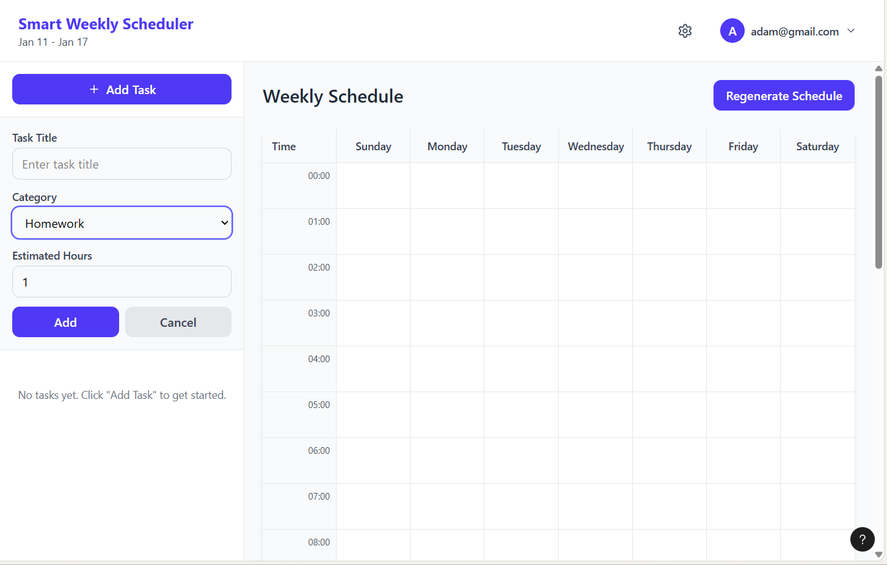
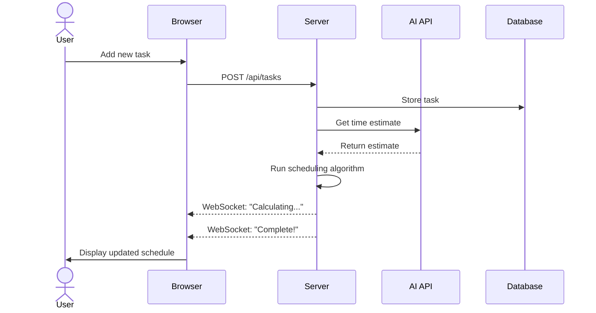

# Smart Weekly Scheduler

[My Notes](notes.md)

A personal scheduling app that automatically generates optimized weekly schedules based on your tasks, time constraints, and preferences. Lock in fixed commitments and let the app intelligently distribute remaining tasks across your week for maximum productivity.

> [!NOTE]
> This is a template for your startup application. You must modify this `README.md` file for each phase of your development. You only need to fill in the section for each deliverable when that deliverable is submitted in Canvas. Without completing the section for a deliverable, the TA will not know what to look for when grading your submission. Feel free to add additional information to each deliverable description, but make sure you at least have the list of rubric items and a description of what you did for each item.

> [!NOTE]
> If you are not familiar with Markdown then you should review the [documentation](https://docs.github.com/en/get-started/writing-on-github/getting-started-with-writing-and-formatting-on-github/basic-writing-and-formatting-syntax) before continuing.

## 🚀 Specification Deliverable

> [!NOTE]
> Fill in this sections as the submission artifact for this deliverable. You can refer to this [example](https://github.com/webprogramming260/startup-example/blob/main/README.md) for inspiration.

For this deliverable I did the following. I checked the box `[x]` and added a description for things I completed.

- [x] Proper use of Markdown
- [x] A concise and compelling elevator pitch
- [x] Description of key features
- [x] Description of how you will use each technology
- [x] One or more rough sketches of your application. Images must be embedded in this file using Markdown image references.

### Elevator pitch

Ever feel overwhelmed trying to fit homework, chores, work, and personal time into your busy week? Smart Weekly Scheduler takes the stress out of planning. Simply add your tasks, lock in fixed commitments like classes or meetings, and let the app automatically generate an optimized schedule that respects your priorities and daily hour limits. With intelligent task distribution powered by AI-assisted time estimates, you'll spend less time planning and more time doing. Whether you're a student juggling coursework or a professional balancing multiple responsibilities, Smart Weekly Scheduler helps you make the most of every hour.

### Design

The application consists of two main views. The **Login page** features a centered card with email and password fields against a soft lavender gradient background, with options to register for new users. The **Dashboard** displays a weekly calendar grid (Sunday–Saturday) with hourly time slots as the main content area. A left sidebar contains the "+ Add Task" button which expands to reveal a task form with fields for title, category (dropdown with options like Homework), and estimated hours. The header shows the current week's date range, a settings icon, and the logged-in user's email. A "Regenerate Schedule" button triggers the scheduling algorithm to optimize task placement across the week.

### Key features

- Mark tasks as immutable (fixed time) or flexible for automatic scheduling
- Category-based priority system (homework, chores, work, personal) for intelligent task ordering
- Automatic distribution of flexible tasks around fixed commitments
- Set daily hour capacity limits to prevent overloading
- AI-powered time estimates and scheduling optimization suggestions
- Real-time schedule regeneration with live progress feedback

### Technologies

I am going to use the required technologies in the following ways.

- **HTML** - Two main pages: Login/Register and Dashboard. Semantic structure with forms for task input (title, category, hours, fixed/flexible toggle) and a weekly schedule grid display.
- **CSS** - Responsive weekly calendar grid showing 7 days with time blocks. Color-coded task categories, clean styling with good whitespace and contrast, and simple animations for schedule updates.
- **React** - Components for LoginForm, WeeklyCalendar, TaskList, TaskForm, and PreferencesPanel. React Router for Login → Dashboard navigation. State management for reactive schedule regeneration when tasks are added or modified.
- **Service** - Backend endpoints for task CRUD operations, schedule generation algorithm, user preferences, and authentication. Calls OpenAI/Anthropic API for intelligent task time estimates and schedule optimization suggestions.
- **DB/Login** - Store user credentials with hashed passwords, tasks (title, category, hours, immutable flag, time slot), and preferences (category priorities, daily limits). Secure authentication with registration, login, and logout functionality.
- **WebSocket** - Real-time feedback during schedule regeneration ("Calculating schedule..." → "Complete!"). Push notifications when schedule finishes regenerating after adding or editing tasks. Live progress indicator during optimization.

## 🚀 AWS deliverable

For this deliverable I did the following. I checked the box `[x]` and added a description for things I completed.

- [ ] **Server deployed and accessible with custom domain name** - [My server link](https://yourdomainnamehere.click).

## 🚀 HTML deliverable

For this deliverable I did the following. I checked the box `[x]` and added a description for things I completed.

- [ ] **HTML pages** - I did not complete this part of the deliverable.
- [ ] **Proper HTML element usage** - I did not complete this part of the deliverable.
- [ ] **Links** - I did not complete this part of the deliverable.
- [ ] **Text** - I did not complete this part of the deliverable.
- [ ] **3rd party API placeholder** - I did not complete this part of the deliverable.
- [ ] **Images** - I did not complete this part of the deliverable.
- [ ] **Login placeholder** - I did not complete this part of the deliverable.
- [ ] **DB data placeholder** - I did not complete this part of the deliverable.
- [ ] **WebSocket placeholder** - I did not complete this part of the deliverable.

## 🚀 CSS deliverable

For this deliverable I did the following. I checked the box `[x]` and added a description for things I completed.

- [ ] **Visually appealing colors and layout. No overflowing elements.** - I did not complete this part of the deliverable.
- [ ] **Use of a CSS framework** - I did not complete this part of the deliverable.
- [ ] **All visual elements styled using CSS** - I did not complete this part of the deliverable.
- [ ] **Responsive to window resizing using flexbox and/or grid display** - I did not complete this part of the deliverable.
- [ ] **Use of a imported font** - I did not complete this part of the deliverable.
- [ ] **Use of different types of selectors including element, class, ID, and pseudo selectors** - I did not complete this part of the deliverable.

## 🚀 React part 1: Routing deliverable

For this deliverable I did the following. I checked the box `[x]` and added a description for things I completed.

- [ ] **Bundled using Vite** - I did not complete this part of the deliverable.
- [ ] **Components** - I did not complete this part of the deliverable.
- [ ] **Router** - I did not complete this part of the deliverable.

## 🚀 React part 2: Reactivity deliverable

For this deliverable I did the following. I checked the box `[x]` and added a description for things I completed.

- [ ] **All functionality implemented or mocked out** - I did not complete this part of the deliverable.
- [ ] **Hooks** - I did not complete this part of the deliverable.

## 🚀 Service deliverable

For this deliverable I did the following. I checked the box `[x]` and added a description for things I completed.

- [ ] **Node.js/Express HTTP service** - I did not complete this part of the deliverable.
- [ ] **Static middleware for frontend** - I did not complete this part of the deliverable.
- [ ] **Calls to third party endpoints** - I did not complete this part of the deliverable.
- [ ] **Backend service endpoints** - I did not complete this part of the deliverable.
- [ ] **Frontend calls service endpoints** - I did not complete this part of the deliverable.
- [ ] **Supports registration, login, logout, and restricted endpoint** - I did not complete this part of the deliverable.

## 🚀 DB deliverable

For this deliverable I did the following. I checked the box `[x]` and added a description for things I completed.

- [ ] **Stores data in MongoDB** - I did not complete this part of the deliverable.
- [ ] **Stores credentials in MongoDB** - I did not complete this part of the deliverable.

## 🚀 WebSocket deliverable

For this deliverable I did the following. I checked the box `[x]` and added a description for things I completed.

- [ ] **Backend listens for WebSocket connection** - I did not complete this part of the deliverable.
- [ ] **Frontend makes WebSocket connection** - I did not complete this part of the deliverable.
- [ ] **Data sent over WebSocket connection** - I did not complete this part of the deliverable.
- [ ] **WebSocket data displayed** - I did not complete this part of the deliverable.
- [ ] **Application is fully functional** - I did not complete this part of the deliverable.
